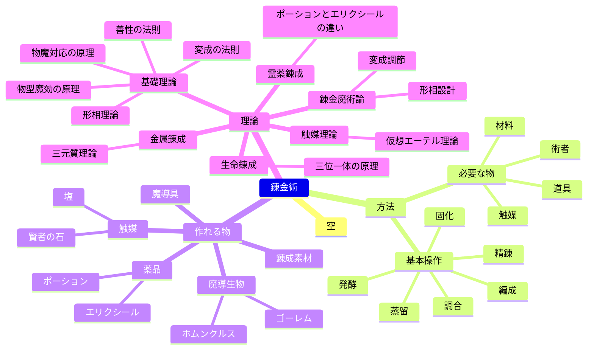

# 錬金術アイデア出し

作成日時: 2024年5月28日 22:44

```mermaid
mindmap
	錬金術
		空
		方法
			必要な物
				材料
				道具
				触媒
				術者
			基本操作
				精錬
				蒸留
				調合
				編成
				固化
				発酵
		作れる物
			薬品
				エリクシール
				ポーション
			魔導生物
				ゴーレム
				ホムンクルス
			錬成素材
			魔導具
			触媒
				塩
				賢者の石
		理論
			基礎理論
				物魔対応の原理
				変成の法則
				物型魔効の原理
				形相理論
				善性の法則
			錬金魔術論
				形相設計
				変成調節
			金属錬成
				三元質理論
			霊薬錬成
				ポーションとエリクシールの違い
			生命錬成	
				三位一体の原理
			触媒理論
				仮想エーテル理論
```