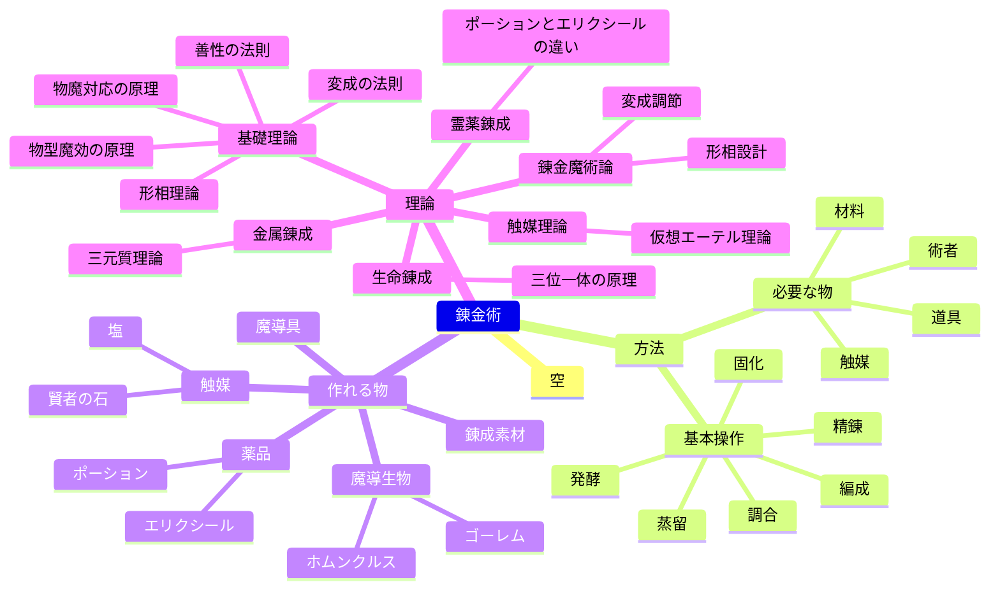

# 錬金術アイデア出し

[構想メモ一覧](README.md) · [資料集の入口](../README.md)

> 原資料ではネタストック／アイデアメモに置かれていた構想。今回の整理で設定本文への採用を確定していない。

## 出典

- [錬金術アイデア出し 209aedc6594841498705dcf3d67a67cd.md](../../_imports/2026-09-07-notion/raw/%E3%83%AA%E3%83%AA%E3%82%A2%E3%83%BC%E3%83%8A%E3%81%AE%E9%AD%94%E8%A1%93%E5%B8%AB%E8%87%AA%E5%8F%99%E4%BC%9D/%E3%82%A2%E3%82%A4%E3%83%87%E3%82%A2%E3%83%A1%E3%83%A2/%E9%8C%AC%E9%87%91%E8%A1%93%E3%82%A2%E3%82%A4%E3%83%87%E3%82%A2%E5%87%BA%E3%81%97%20209aedc6594841498705dcf3d67a67cd.md)
